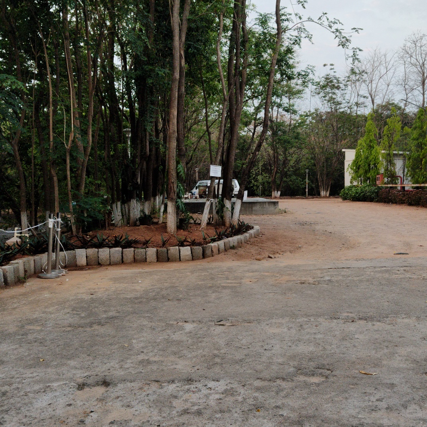

#  Directional Photo Capture App

It is a Flutter mobile application that captures square photos while automatically recording compass direction, GPS coordinates, and timestamp in the filename.



## Features

- Square (1:1 aspect ratio) photo capture
- Compass direction tracking (degrees and cardinal directions)
- GPS location recording
- Automatic filename generation with time, location, and angle data
- Real-time display of current direction and location

## Dependencies

The app requires the following Flutter packages:
- `camera`: For camera access and photo capture
- `path_provider`: For accessing device directories
- `geolocator`: For GPS location services
- `permission_handler`: For managing app permissions
- `flutter_compass`: For compass heading data
- `image`: For image processing (cropping)
- `intl`: For date/time formatting

> **Note:** Due to compatibility issues between certain packages and Android versions, this app implements a custom solution for saving images rather than using deprecated gallery packages. The implementation uses direct file system access with proper media scanning to ensure photos are accessible.

## Confirmed Working Packages

The following packages have been specifically tested and confirmed to work:
- `permission_handler`
- `camera` (CameraController class)

Other gallery-related packages like `gallery_saver_updated` may have compatibility issues with certain Android versions. and `gallery_saver` is been depriciated. 

## How It Works

1. The app requests necessary permissions (camera, location, storage)
2. Camera preview is displayed in a square format
3. Current compass direction and location are shown on screen
4. When a photo is taken, it's:
   - Cropped to a perfect square
   - Saved with a filename containing timestamp, GPS coordinates, and compass angle
   - Manually added to the media library through file scanning (due to gallery package limitations)

## Photo Storage

Photos are saved in the following locations:
- **Android**: `/storage/emulated/0/Pictures/AnglePhotos/`
- **iOS**: In the app's documents directory under `AnglePhotos/`

Filename format: `Time_HH_MM_Location_LAT_LONG_Angle_XXX.jpg`

## Android Storage Notes

Due to changes in Android's storage framework (particularly in Android 10+), the app:
- Uses direct file access with the appropriate permissions
- Implements a custom file scanning method to make photos visible in the gallery
- Requests specific permissions (`WRITE_EXTERNAL_STORAGE`, `READ_EXTERNAL_STORAGE`, `ACCESS_MEDIA_LOCATION`) as needed

## How to Run

1. Clone the repository
2. Install Flutter dependencies:
   ```
   flutter pub get
   ```
3. Run the app:
   ```
   flutter run
   ```

## Compatibility
Not so sure but at least works for Android 13. 

Should work for. 
- Android 6.0+ (API level 23+) 
- iOS 12.0+

Note: Some features may require additional configuration on Android 10+ (API level 29+) due to scoped storage changes.

## Use Cases

- Collection of dataset of images with spatial orentation


## Permissions Required

- Camera access
- Location services
- Storage access (for saving photos)
- Media library access (for Android 10+)
